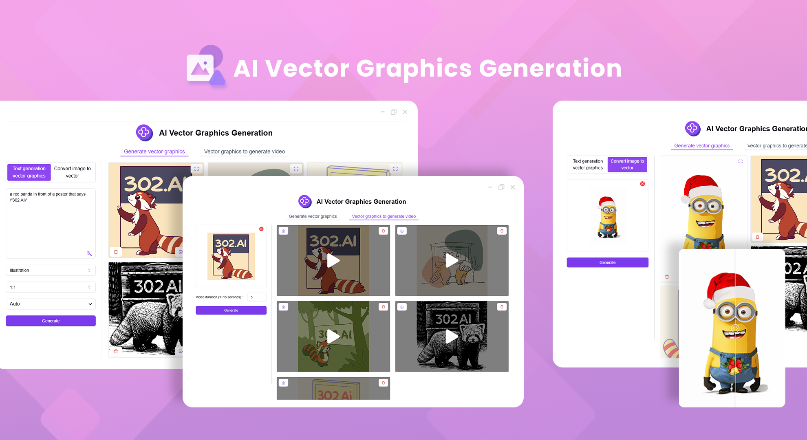
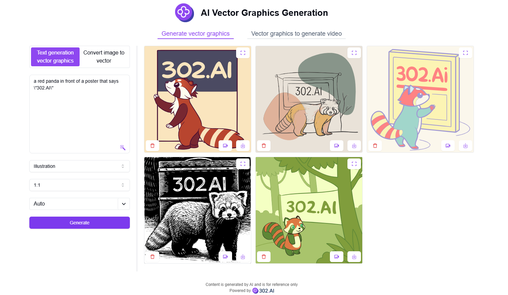
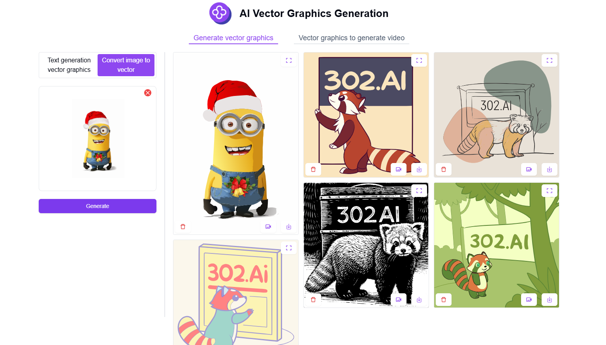
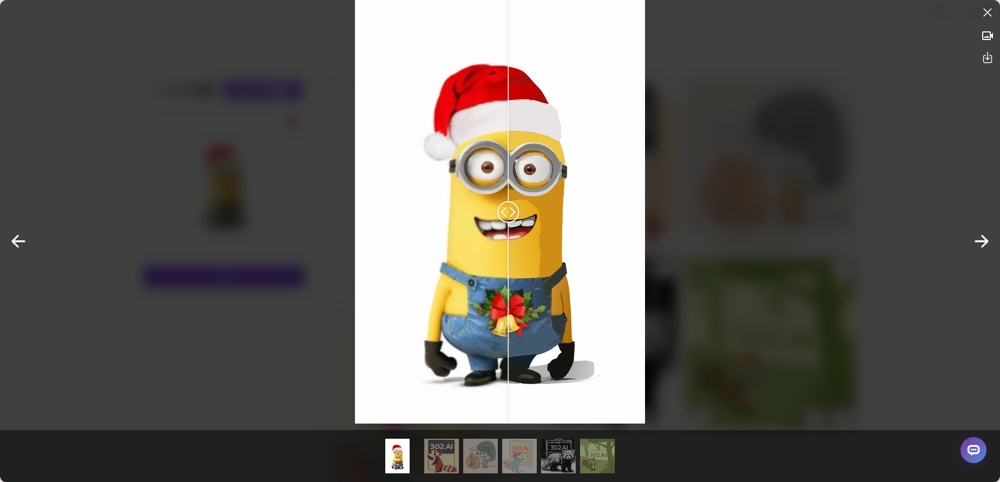
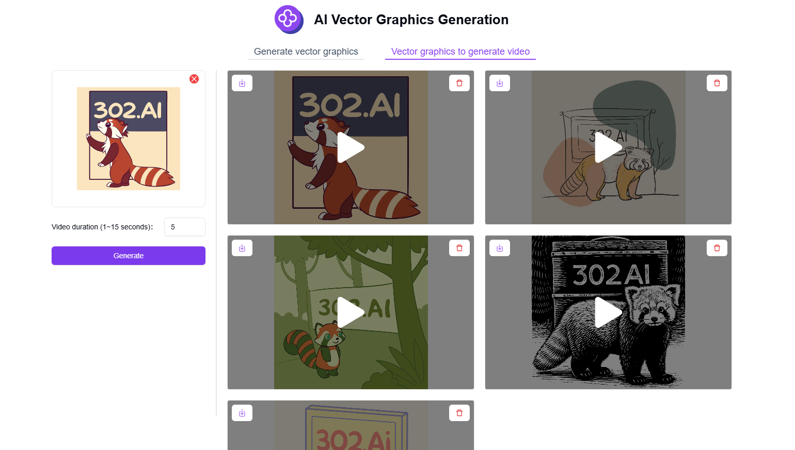

# <p align="center"> 🖼️ AI Vector Graphics Generation 🚀✨</p>

<p align="center">AI Vector Graphics Generation allows you to generate vector graphics using AI through text descriptions or image uploads, and even create videos from vector graphics.</p>

<p align="center"><a href="https://302.ai/en/tools/vector/" target="blank"></a></p >

<p align="center"><a href="README_zh.md">中文</a> | <a href="README.md">English</a> | <a href="README_ja.md">日本語</a></p>



This is the open-source version of the [AI Vector Graphics Generation](https://302.ai/en/tools/vector/) from [302.AI](https://302.ai/en/). You can directly log in to 302.AI to use the online version with zero code and zero background, or modify and deploy it yourself according to your requirements.

## Interface Preview
Enter text descriptions and select your desired style, ratio, and color to generate vector graphics using AI.


Upload image files to convert them into vector graphics using AI.
           

Generated vector graphics support zooming and downloading. For images converted to vector graphics, you can use the image comparison slider to examine details.
        

Upload vector graphics and select video duration to generate vector graphics videos using AI.
      

Example of video generation from vector graphics.   
<video src="https://github.com/user-attachments/assets/490c1ffd-9def-408d-a830-512f5563e13e" controls></video>

## Project Features
### 🎨 Text to Vector Graphics
Generate vector graphics using AI through text descriptions, style selection, ratio, and color choices.
### 🖼️ Image to Vector Graphics
Convert uploaded images into vector graphics format using AI.
### 🎬 Vector Graphics to Video
Generate dynamic video effects from vector graphics.
### 🔍 High-Resolution Zoom
Generated vector graphics support lossless zooming and downloading.
### 🌓 Dark Mode
Supports dark mode to protect your eyes.
### 🌍 Multi-language Support
- Chinese Interface
- English Interface
- Japanese Interface

## 🚩 Future Update Plans
- [ ] Add more vector graphics style options
- [ ] Support batch image conversion

## 🛠️ Tech Stack

- **Framework**: Next.js 14
- **Language**: TypeScript
- **Styling**: TailwindCSS
- **UI Components**: Radix UI
- **State Management**: Jotai
- **Form Handling**: React Hook Form
- **HTTP Client**: ky
- **i18n**: next-intl
- **Theming**: next-themes
- **Code Standards**: ESLint, Prettier
- **Commit Standards**: Husky, Commitlint

## Development & Deployment
1. Clone the project
```bash
git clone https://github.com/302ai/302_vector_graphics_generation
cd 302_vector_graphics_generation
```

2. Install dependencies
```bash
pnpm install
```

3. Configure environment
```bash
cp .env.example .env.local
```
Modify the environment variables in `.env.local` as needed.

4. Start development server
```bash
pnpm dev
```

5. Build for production
```bash
pnpm build
pnpm start
```

## ✨ About 302.AI ✨
[302.AI](https://302.ai/en/) is an enterprise-oriented AI application platform that offers pay-as-you-go services, ready-to-use solutions, and an open-source ecosystem.✨
1. 🧠 Comprehensive AI capabilities: Incorporates the latest in language, image, audio, and video models from leading AI brands.
2. 🚀 Advanced application development: We build genuine AI products, not just simple chatbots.
3. 💰 No monthly fees: All features are pay-per-use, fully accessible, ensuring low entry barriers with high potential.
4. 🛠 Powerful admin dashboard: Designed for teams and SMEs - managed by one, used by many.
5. 🔗 API access for all AI features: All tools are open-source and customizable (in progress).
6. 💡 Powerful development team: Launching 2-3 new applications weekly with daily product updates. Interested developers are welcome to contact us.