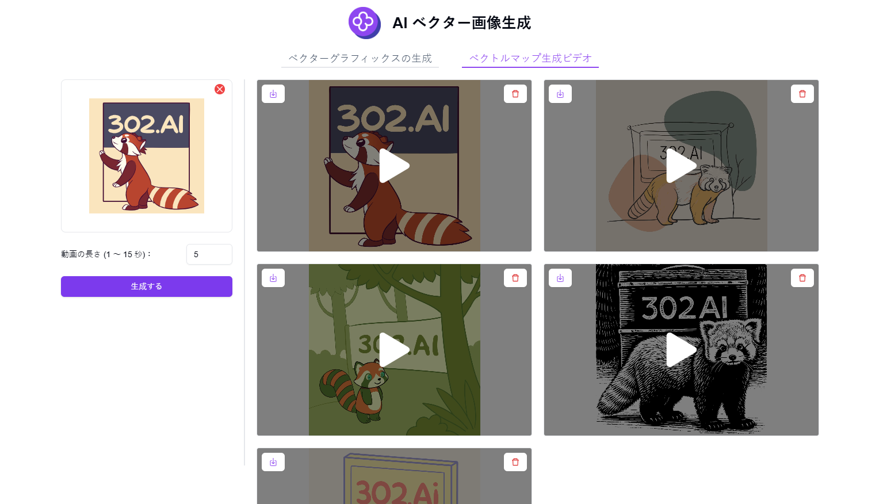

# <p align="center"> 🖼️ AI ベクター画像生成 🚀✨</p>

<p align="center">AIベクター画像生成は、テキスト入力や画像アップロードを通じてAIでベクター画像を生成し、さらにそのベクター画像から動画を作成することができます。</p>

<p align="center"><a href="https://302.ai/ja/tools/vector/" target="blank"></a></p >

<p align="center"><a href="README_zh.md">中文</a> | <a href="README.md">English</a> | <a href="README_ja.md">日本語</a></p>


[302.AI](https://302.ai/ja/)の[AI ベクター画像生成](https://302.ai/ja/tools/vector/)のオープンソース版です。
302.AIに直接ログインすることで、コード不要、設定不要のオンライン体験が可能です。
あるいは、このプロジェクトをニーズに合わせてカスタマイズし、302.AIのAPI KEYを統合して、自身でデプロイすることもできます。

## インターフェースプレビュー
テキスト説明を入力し、希望するスタイル、比率、色を選択することで、AIを使用してベクター画像を生成できます。


画像ファイルをアップロードすることで、AIを使用してベクター画像に変換できます。
           

生成されたベクター画像は拡大表示とダウンロードに対応しています。画像から変換されたベクター画像は、画像比較スライダーを使用して詳細を確認できます。
        

ベクター画像をアップロードし、動画の長さを選択することで、AIを使用してベクター画像の動画を生成できます。
      

ベクター画像から生成された動画の例。   
<video src="https://github.com/user-attachments/assets/490c1ffd-9def-408d-a830-512f5563e13e" controls></video>

## プロジェクトの特徴
### 🎨 テキストからベクター画像生成
テキスト説明、スタイル選択、比率、色の選択を通じて、AIでベクター画像を生成します。
### 🖼️ 画像からベクター画像への変換
アップロードした画像をAIを使用してベクター画像形式に変換します。
### 🎬 ベクター画像から動画生成
ベクター画像からダイナミックな動画効果を生成します。
### 🔍 高解像度ズーム
生成されたベクター画像は劣化なしでズームとダウンロードに対応しています。
### 🌓 ダークモード
ダークモードをサポートしており、あなたの目を保護します。
### 🌍 多言語サポート
- 中国語インターフェース
- 英語インターフェース
- 日本語インターフェース

## 🚩 将来のアップデート計画
- [ ] より多くのベクター画像スタイルオプションの追加
- [ ] 一括画像変換機能のサポート

## 🛠️ 技術スタック

- **フレームワーク**: Next.js 14
- **言語**: TypeScript
- **スタイリング**: TailwindCSS
- **UIコンポーネント**: Radix UI
- **状態管理**: Jotai
- **フォーム処理**: React Hook Form
- **HTTPクライアント**: ky
- **国際化**: next-intl
- **テーマ**: next-themes
- **コード規約**: ESLint, Prettier
- **コミット規約**: Husky, Commitlint

## 開発&デプロイ
1. プロジェクトのクローン
```bash
git clone https://github.com/302ai/302_vector_graphics_generation
cd 302_vector_graphics_generation
```

2. 依存関係のインストール
```bash
pnpm install
```

3. 環境設定
```bash
cp .env.example .env.local
```
必要に応じて`.env.local`の環境変数を修正してください。

4. 開発サーバーの起動
```bash
pnpm dev
```

5. プロダクションビルド
```bash
pnpm build
pnpm start
```

## ✨ 302.AIについて ✨
[302.AI](https://302.ai/ja/)は企業向けのAIアプリケーションプラットフォームであり、必要に応じて支払い、すぐに使用できるオープンソースのエコシステムです。✨
1. 🧠 包括的なAI機能：主要AIブランドの最新の言語、画像、音声、ビデオモデルを統合。
2. 🚀 高度なアプリケーション開発：単なるシンプルなチャットボットではなく、本格的なAI製品を構築。
3. 💰 月額料金なし：すべての機能が従量制で、完全にアクセス可能。低い参入障壁と高い可能性を確保。
4. 🛠 強力な管理ダッシュボード：チームやSME向けに設計 - 一人で管理し、多くの人が使用可能。
5. 🔗 すべてのAI機能へのAPIアクセス：すべてのツールはオープンソースでカスタマイズ可能（進行中）。
6. 💪 強力な開発チーム：大規模で高度なスキルを持つ開発者集団。毎週2-3の新しいアプリケーションをリリースし、毎日製品更新を行っています。才能ある開発者の参加を歓迎します。