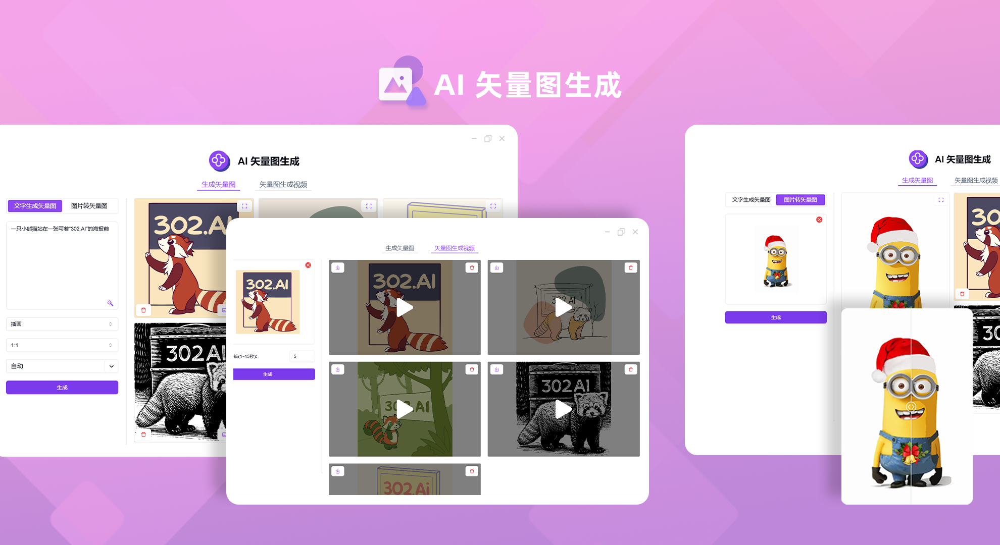
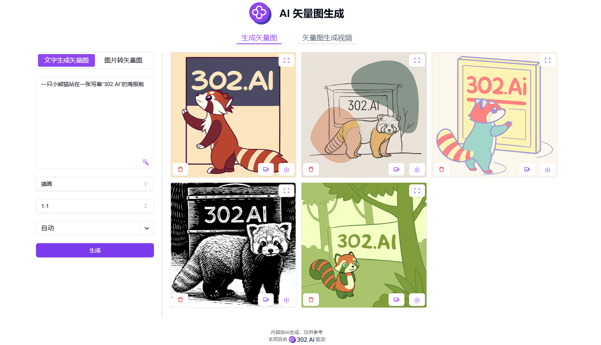
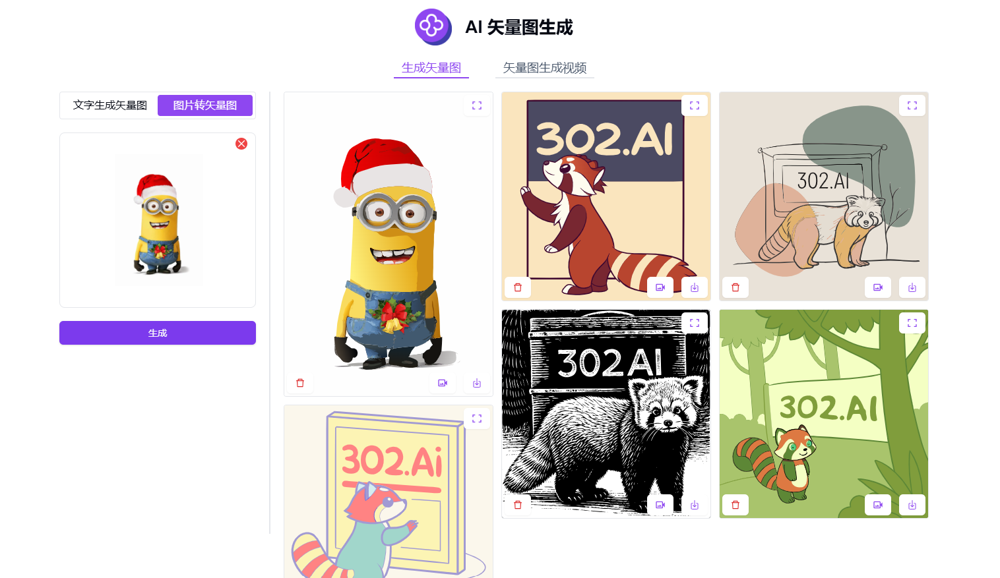
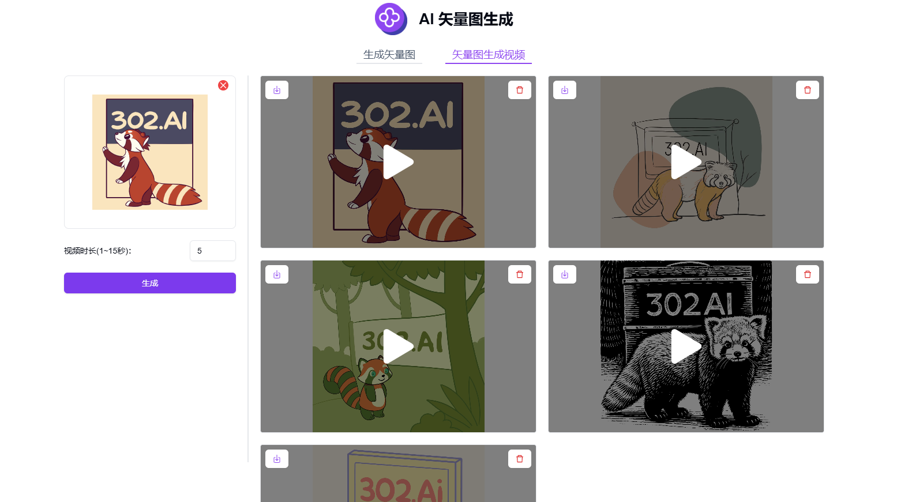

# <p align="center"> 🖼️ AI 矢量图生成 🚀✨</p>

<p align="center">AI矢量图生成通过上传图片或文字输入描述，即可使用AI生成矢量图，还可以根据矢量图生成视频。</p>

<p align="center"><a href="https://302.ai/tools/vector/" target="blank"></a></p >

<p align="center"><a href="README_zh.md">中文</a> | <a href="README.md">English</a> | <a href="README_ja.md">日本語</a></p>



来自[302.AI](https://302.ai)的[AI 矢量图生成](https://302.ai/tools/vector/)的开源版本。你可以直接登录302.AI，零代码零配置使用在线版本。或者对本项目根据自己的需求进行修改，传入302.AI的API KEY，自行部署。

## 界面预览
根据输入的文字描述，选择你想要的风格、比例以及颜色，即可使用AI生成矢量图。


上传图片文件，即可使用AI转成矢量图。
           

生成的矢量图均支持放大查看和下载。由图片转成的矢量图，可以放大使用图片对比滑块查看细节。
        

根据上传的矢量图，选择视频时长，即可使用AI生成矢量图视频。
      

根据矢量图生成视频的生成效果。   
<video src="https://github.com/user-attachments/assets/490c1ffd-9def-408d-a830-512f5563e13e" controls></video>
 
## 项目特性
### 🎨 文本生成矢量图
通过文字描述，选择风格、比例和颜色，即可使用AI生成矢量图。
### 🖼️ 图片转矢量图
上传图片文件，即可使用AI将其转换成矢量图形式。
### 🎬 矢量图生成视频
根据矢量图生成动态视频效果。
### 🔍 高清放大
生成的矢量图支持无损放大查看和下载。
### 🌓 暗色模式
支持暗色模式，保护您的眼睛。
### 🌍 多语言支持
  - 中文界面
  - English Interface
  - 日本語インターフェース

## 🚩 未来更新计划
- [ ] 新增更多矢量图风格选项
- [ ] 支持批量图片转换功能

## 🛠️ 技术栈

- **框架**: Next.js 14
- **语言**: TypeScript
- **样式**: TailwindCSS
- **UI组件**: Radix UI
- **状态管理**: Jotai
- **表单处理**: React Hook Form
- **HTTP客户端**: ky
- **国际化**: next-intl
- **主题**: next-themes
- **代码规范**: ESLint, Prettier
- **提交规范**: Husky, Commitlint

## 开发&部署
1. 克隆项目
```bash
git clone https://github.com/302ai/302_vector_graphics_generation
cd 302_vector_graphics_generation
```

2. 安装依赖
```bash
pnpm install
```

3. 环境配置
```bash
cp .env.example .env.local
```
根据需要修改 `.env.local` 中的环境变量。

4. 启动开发服务器
```bash
pnpm dev
```

5. 构建生产版本
```bash
pnpm build
pnpm start
```

## ✨ 302.AI介绍 ✨
[302.AI](https://302.ai)是一个按需付费的AI应用平台，为用户解决AI用于实践的最后一公里问题。
1. 🧠 集合了最新最全的AI能力和品牌，包括但不限于语言模型、图像模型、声音模型、视频模型。
2. 🚀 在基础模型上进行深度应用开发，我们开发真正的AI产品，而不是简单的对话机器人
3. 💰 零月费，所有功能按需付费，全面开放，做到真正的门槛低，上限高。
4. 🛠 功能强大的管理后台，面向团队和中小企业，一人管理，多人使用。
5. 🔗 所有AI能力均提供API接入，所有工具开源可自行定制（进行中）。
6. 💡 强大的开发团队，每周推出2-3个新应用，产品每日更新。有兴趣加入的开发者也欢迎联系我们
